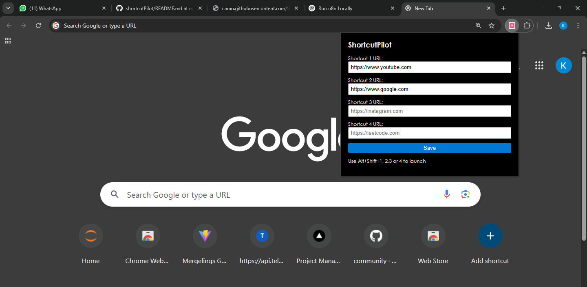

# 🚀 ShortcutPilot – Custom Site Launcher Extension

**ShortcutPilot** is a simple and intuitive Chrome extension that allows you to create and manage your own website shortcuts. Use custom labels and URLs, then assign keyboard shortcuts via Chrome's extension settings to quickly launch your favorite websites.

---

## ✨ Features

- ✅ Add multiple custom shortcuts with labels
- 🗑️ Remove any shortcut instantly with a delete button
- 💾 Save and auto-persist shortcuts using Chrome's local storage
- ⚙️ Assign keyboard shortcuts at `chrome://extensions/shortcuts`
- 🧠 Clean, responsive, and user-friendly UI

---

## 📦 Folder Structure

shortcutpilot/
├── manifest.json # Chrome extension manifest (v3) 
├── popup.html # Popup UI  
├── popup.js # Dynamic JS to add/remove/save shortcuts 
├── styles.css # Clean modern styling 
└── icon.png # (Optional) Extension icon 

---

## 🔧 How to Install

1. Clone or download this repo.
2. Open Chrome and go to: `chrome://extensions`
3. Enable **Developer Mode** (top right).
4. Click **Load unpacked** and select the `shortcutpilot` folder.
5. Click the extension icon to add shortcuts.
6. Visit `chrome://extensions/shortcuts` to assign keyboard keys to open the extension or trigger an action.

---

## 📸 Preview

  

---

## 📝 Example Use

| Label         | URL                         | Chrome Shortcut      |
|---------------|-----------------------------|-----------------------|
| YouTube       | `https://youtube.com`       | `Ctrl+Shift+1`        |
| GitHub        | `https://github.com`        | `Ctrl+Shift+2`        |

---

## 🛠 Tech Used

- HTML5  
- CSS3  
- Vanilla JavaScript  
- Chrome Extension Manifest V3  
- Chrome `storage.sync` API

---

## 📌 Notes

- Chrome does **not** allow extensions to dynamically register shortcut keys.
- You must manually assign keys at [`chrome://extensions/shortcuts`](chrome://extensions/shortcuts) for security.

---

## 🤝 License

 Feel free to fork, modify, and contribute!

---

## 👋 Author

Made with 💻 by Karishma Solanki

